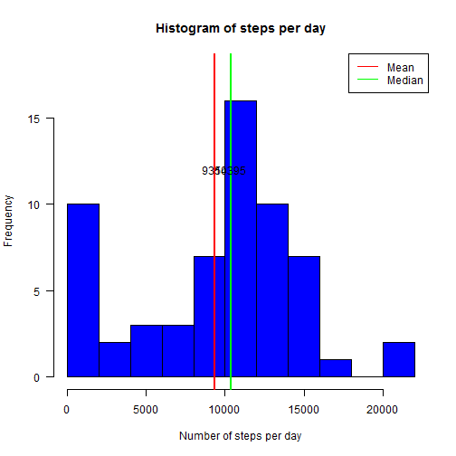
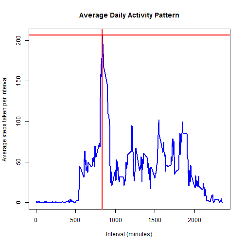
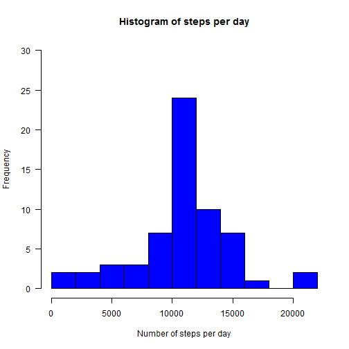
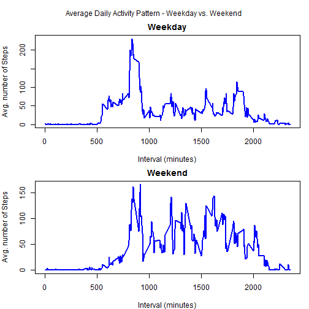

## Activity Monitoring Data Analysis

This is data from a personal activity monitoring device. This device collects data at 5 minute intervals through out the day. The data consists of two months of data from an anonymous individual collected during the months of October and November, 2012 and include the number of steps taken in 5 minute intervals each day.

Loading and preprocessing data. The total number of steps per day comes from dataset "x".

```r
## Code for reading in the dataset and/or processing the data

# setwd(<directory name>)
if(!file.exists("./data")) { dir.create("./data")}
con <- "https://d396qusza40orc.cloudfront.net/repdata%2Fdata%2Factivity.zip"
library(downloader)
download(con, dest = "./data/projectdata.zip")
unzip("./data/projectdata.zip", list = TRUE)
```

```
##           Name Length                Date
## 1 activity.csv 350829 2014-02-11 10:08:00
```

```r
act <- read.csv(unz("./data/projectdata.zip","activity.csv"), 
                  header = TRUE, 
                  stringsAsFactors = FALSE,
                  na.strings = NA,
                  colClasses = c("numeric", "Date", "numeric"))
head(act, 10)
```

```
##    steps       date interval
## 1     NA 2012-10-01        0
## 2     NA 2012-10-01        5
## 3     NA 2012-10-01       10
## 4     NA 2012-10-01       15
## 5     NA 2012-10-01       20
## 6     NA 2012-10-01       25
## 7     NA 2012-10-01       30
## 8     NA 2012-10-01       35
## 9     NA 2012-10-01       40
## 10    NA 2012-10-01       45
```

```r
str(act)
```

```
## 'data.frame':	17568 obs. of  3 variables:
##  $ steps   : num  NA NA NA NA NA NA NA NA NA NA ...
##  $ date    : Date, format: "2012-10-01" "2012-10-01" ...
##  $ interval: num  0 5 10 15 20 25 30 35 40 45 ...
```

```r
library(dplyr)
x <- summarise(group_by(act, date), steps = sum(steps, na.rm = TRUE))
```


Mean total number of steps taken per day

```r
## Histogram of the total number of steps taken each day

hist(x$steps, 
     xlab = "Number of steps per day", 
     col = "blue",
     main = "Histogram of steps per day", 
     xlim = c(0, 22000),
     ylim = c(0, 18),
     las = 1,
     breaks = 10
     )
abline(v = mean(x$steps), col = "red", lwd = 2)
text(mean(x$steps), 12, round(mean(x$steps),0))
abline(v = median(x$steps), col = "green", lwd = 2)
text(median(x$steps), 12, round(median(x$steps),0))
legend("topright", lty = c(1, 1), col = c("red", "green"), 
       legend = c("Mean", "Median"))
```

 

Mean total number of steps taken per day

```r
## Mean and median of total number of steps taken each day
MeanSteps <- mean(x$steps)
MedianSteps <- median(x$steps)
```


Average daily activity pattern - Summarise the data by each 5 minute intervals, and get the average for each of them. 

```r
## Time series plot of the average number of steps taken

y <- summarise(group_by(act, interval), steps = mean(steps, na.rm = TRUE))
plot(y$interval, 
     y$steps, 
     type = "l",
     lwd = 2,
     col = "blue", 
     main = "Average Daily Activity Pattern",
     xlab = "Interval (minutes)",
     ylab = "Average steps taken per interval"
     )

## The 5-minute interval that, on average, contains the maximum number of steps.

horiz = max(y$steps); vert = y$interval[y$steps == horiz]
abline(h = horiz, v = vert, lwd = 2, col = "red")
```

 

```r
vert                                ## Interval with max. steps
```

```
## [1] 835
```

Imputing missing values
Missing values for "steps" at each 5-min interval in the data is replaced by the mean number of steps for that 5-min interval. 

```r
## Code to describe and show a strategy for imputing missing data

z <- summarise(group_by(act, interval), modsteps = round(mean(steps, na.rm = TRUE),0))
new <- merge(z, act, by = "interval")
new <- new[order(new$date),]
new <- mutate(new, steps = ifelse(is.na(steps), modsteps, steps))
zz <- summarise(group_by(new, date), steps = sum(steps, na.rm = TRUE))
```

Differences in activity patterns between weekdays and weekends

```r
## Histogram of the total number of steps taken each day after missing values are imputed

hist(zz$steps, 
     xlab = "Number of steps per day", 
     col = "blue",
     main = "Histogram of steps per day", 
     xlim = c(0, 22000),
     ylim = c(0, 30),
     las = 1,
     breaks = 10
)
```

 

```r
## Mean and median of total number of steps taken each day (after imputing for missing data)

MeanModSteps <- mean(zz$steps)
MedianModSteps <- median(zz$steps)
```


```r
## Creating factor variables for days as weekday or weekend

new$day <- as.factor(ifelse(weekdays(new$date) %in% c("Sunday", "Saturday"),"weekend", "weekday"))
wkday <- summarise(group_by(subset(new, day == "weekday"), interval), steps = mean(steps, na.rm = TRUE))
wkend <- summarise(group_by(subset(new, day == "weekend"), interval), steps = mean(steps, na.rm = TRUE))
```

There is an increase in activity pattern during weekends compared to weekdays, as evident from the following plot,

```r
## Panel plot comparing the average number of steps taken per 5-minute interval across weekdays and weekends

par(mfrow = c(2,1), mar = c(4, 4, 2, 1), oma = c(0, 0, 2, 0))
with(wkday, {
     plot(interval, steps, type = "l", lwd = 2, col = "blue", ylab = "Avg. number of Steps", xlab = "Interval (minutes)")
     title("Weekday", outer = FALSE)
})
with(wkend, {
     plot(interval, steps, type = "l",lwd = 2, col = "blue", ylab = "Avg. number of Steps", xlab = "Interval (minutes)")
     title("Weekend", outer = FALSE)})
mtext("Average Daily Activity Pattern - Weekday vs. Weekend", outer = TRUE)
```

 

